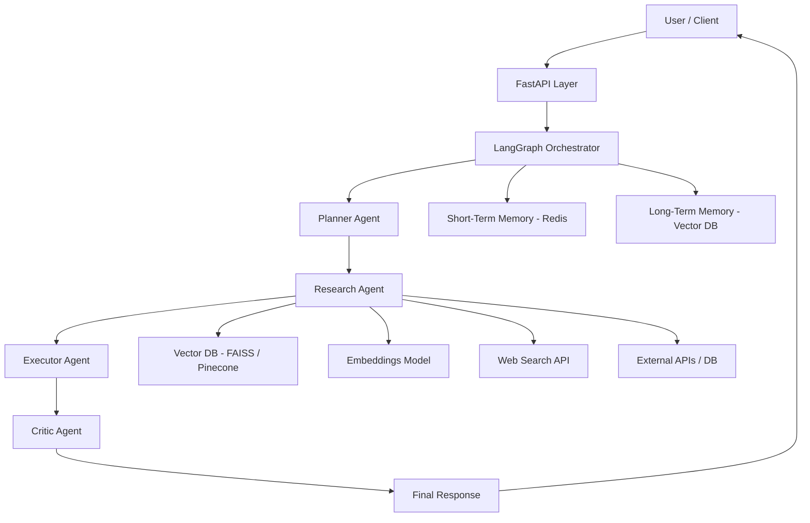
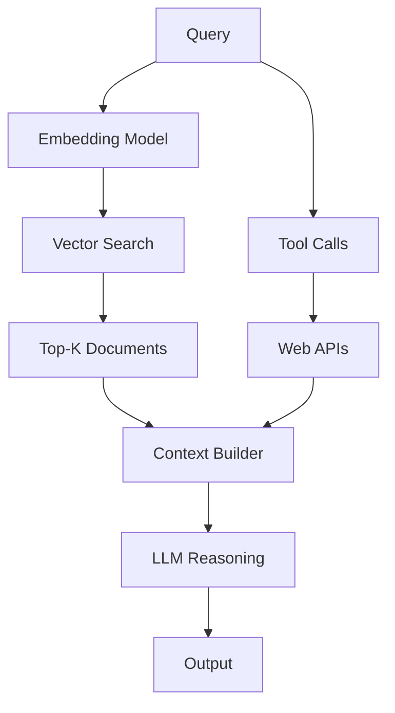
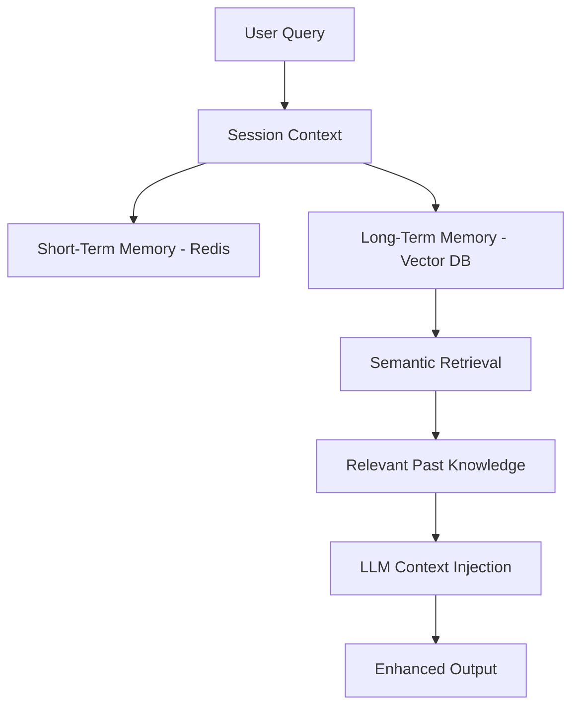
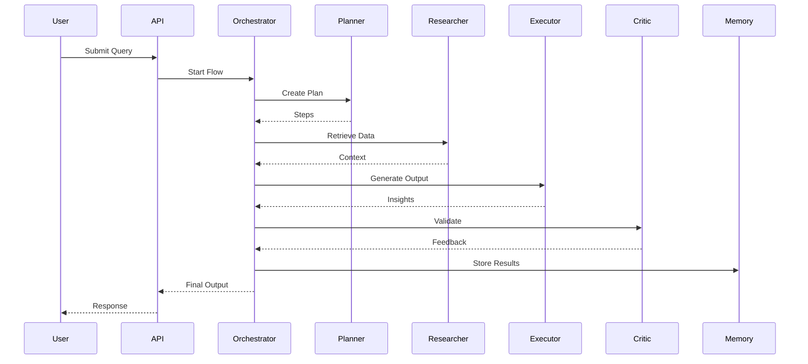
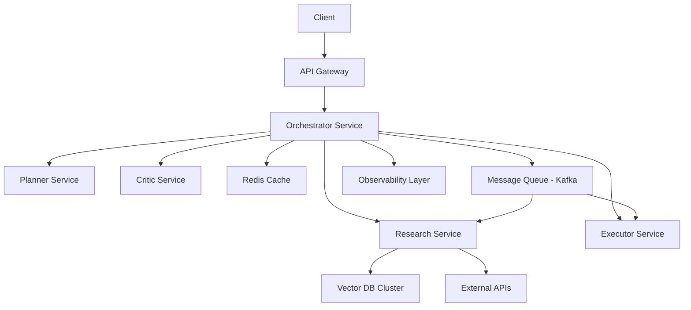

````markdown
# 🧠 Autonomous AI Research Multi-Agent Decision System

### (RAG + Tooling + Memory + LangGraph Orchestration)

---

### core workflow

User Query
↓
Orchestrator (LangGraph / Eliza)
↓
Planner Agent → breaks task
↓
Research Agent → fetches data (RAG + tools)
↓
Executor Agent → synthesizes output
↓
Critic Agent → validates/improves
↓
Memory Layer (store learnings)
↓
Final Output

---

---

## 🏗️ System Architecture


````

---

## 🚀 Project Overview

This project implements an **autonomous multi-agent AI system** capable of:

- Breaking down complex problems
- Retrieving relevant knowledge (RAG + tools)
- Generating structured insights
- Self-evaluating outputs via critic loops
- Persisting memory for continuous improvement

It is designed as a **stateful, extensible AI system**, not a simple LLM wrapper.

---

## 📌 Implementation Spec (Buildable v1)

The README focuses on **architecture + story**. For the exact **MVP scope, acceptance criteria, API schema, LangGraph state, memory semantics, and guardrails**, see:

- `SPEC.md`

---

## 🧪 MVP Definition & Acceptance Criteria (v1)

This section is merged from `workflow-readme.me` (the detailed, buildable version lives in `SPEC.md`).

### 🎯 MVP Scope

The system must:

1. Accept a natural language query
2. Execute the full multi-agent pipeline:
   - Planner → Researcher (RAG + tools) → Executor → Critic
3. Return a structured response including:
   - Plan
   - Final output (structured)
   - Critique (structured, with `should_retry`)
   - Sources
   - Trace / tool calls
4. Persist memory:
   - Short-term snapshot (Redis when available; local snapshot file always)
   - Long-term (FAISS index for RAG and memory)

### ✅ Definition of Done (baseline)

- [ ] `POST /run` returns a valid structured response (schema in `SPEC.md`)
- [ ] Planner generates ≥2 meaningful steps
- [ ] Researcher retrieves:
  - [ ] ≥1 RAG document (once `/data` is populated + ingested)
  - [ ] ≥1 tool response (mock web search in v1)
- [ ] Executor returns structured output (not a raw text blob)
- [ ] Critic returns a structured verdict and retry decision
- [ ] `run_id` present and per-node timings included in `trace`

---

## ⚡ Quickstart (Local)

### 1) Install deps

```bash
python -m venv .venv
source .venv/bin/activate
pip install -r requirements.txt
```

### 2) Start Redis

```bash
docker compose up -d
```

### 3) Run API

```bash
uvicorn app.main:app --reload --host 127.0.0.1 --port 8000 --timeout-graceful-shutdown 5
```

**Ctrl+C seems stuck?** Uvicorn shuts down *gracefully*: it waits for open connections and in-flight work. While **`POST /run`** is inside Gemini (`asyncio.to_thread`), that work can block a thread until **`GEMINI_REQUEST_TIMEOUT_SEC`** (default 120s), so shutdown may not finish until the request ends unless you cap graceful shutdown with `--timeout-graceful-shutdown` (seconds above). If it still hangs, press **Ctrl+C a second time** or in another terminal: `kill -9 $(lsof -t -i:8000)` (replace port if needed).

**Request tracing:** set `LOG_LEVEL=INFO` (default) or `LOG_LEVEL=DEBUG` for more detail, then start Uvicorn (see `.env.example`). You should see `/run` request preview, each LangGraph node (planner → researcher → executor → critic), Gemini start/end, Redis/file snapshot, and critic retry decisions—all prefixed with loggers `capstone.api`, `capstone.workflow`, `capstone.agents`, `capstone.llm`.

### 4) Test

```bash
curl -s localhost:8000/health | jq
curl -s -X POST localhost:8000/run -H 'content-type: application/json' \
  -d '{"query":"Analyze AI startup opportunities","debug":true}' | jq
```

### 5) Web UI (Next.js)

The UI lives in `web/`. It calls `POST /run` on the API (CORS is enabled for `localhost:3000` by default via `CORS_ORIGINS`).

This repo uses **[Bun](https://bun.sh)** for the frontend (faster installs and script startup than npm for most workflows). Install Bun once, then:

```bash
cd web
cp .env.local.example .env.local
bun install
bun run dev
```

Open [http://localhost:3000](http://localhost:3000). Keep the API running on port **8000**, or set `NEXT_PUBLIC_API_URL` in `web/.env.local` to match your backend.

If you prefer npm, `npm install` and `npm run dev` still work; the lockfile for Bun is `bun.lock`.

---

## 🧠 Architecture Deep Dive

## ✅ Execution Guarantees (v1)

- Deterministic agent flow: Planner → Researcher → Executor → Critic
- Critic loop: if `critique.should_retry == true`, route back to **Researcher** (max retries = 2)
- Tool usage via allowlist (web search + optional external APIs)
- Structured response enforced via Pydantic schema
- Every run has a `run_id` and per-node timings in `trace`

### 🔍 RAG + Tool Hybrid Retrieval

#### Operational details (v1)

- **Data source**: local docs in `capstone/data/` (`.md` / `.txt`)
- **Index build**: `python -m app.rag.ingest` → writes `index/rag.index` and `index/rag.meta.jsonl`
- **Chunking**: fixed-size chunks in `app/rag/ingest.py` (chars-based) with overlap
- **Retrieval**: `top_k = 3` with hybrid re-ranking (vector + lexical overlap)



---

### 🧠 Memory Architecture

#### Operational details (v1)

| Type | Storage | Purpose |
| --- | --- | --- |
| Short-term | Redis | run snapshots + session grouping (best-effort) |
| Long-term | FAISS | semantic recall over local docs |

- Store after execution (run snapshot file always; Redis best-effort)
- Retrieve during Researcher phase (`top_k = 3`)



---

### Core Components

#### Multi-Agent System

- **Planner** → Task decomposition
- **Researcher** → RAG + tool-based retrieval
- **Executor** → Insight generation
- **Critic** → Output validation + refinement

#### Orchestration

- LangGraph-based state machine
- Supports loops, retries, and extensibility

#### Tooling Layer

- Web search APIs
- External data sources
- Custom domain APIs (e.g., Web3)

---

## ⚙️ Tech Stack

| Layer         | Technology                     |
| ------------- | ------------------------------ |
| Backend API   | FastAPI (Python)               |
| Orchestration | LangGraph                      |
| LLMs          | Google Gemini (via `GOOGLE_API_KEY`) |
| Embeddings    | OpenAI / Sentence Transformers |
| Vector DB     | FAISS / Pinecone               |
| Memory        | Redis                          |
| Tools         | APIs (Search, DB, Web3, etc.)  |

---

## ✨ Features

- Multi-agent reasoning system
- Task decomposition (Planner)
- Hybrid RAG (vector + tools)
- Memory (short-term + long-term)
- Critic feedback loop
- Structured outputs
- Extensible architecture

---

## 📁 Folder Structure

```
/app
 ├── api/
 ├── agents/
 ├── graph/
 ├── tools/
 ├── memory/
 ├── rag/
 ├── core/
 ├── models/
 ├── utils/
 └── main.py

/data
/index
```

---

## ⚡ Setup Instructions

```bash
git clone https://github.com/your-username/ai-multi-agent-system.git
cd ai-multi-agent-system

python -m venv venv
source venv/bin/activate

pip install -r requirements.txt
```

Create `.env`:

```
GOOGLE_API_KEY=your_key
GEMINI_MODEL=gemini-2.0-flash
REDIS_URL=redis://localhost:6379
```

Run:

```bash
uvicorn app.main:app --reload --host 127.0.0.1 --port 8000 --timeout-graceful-shutdown 5
```

---

## 🌐 API Design

### POST `/run`

#### Request

```json
{
  "query": "Analyze AI startup opportunities",
  "session_id": "optional-session-id",
  "debug": true
}
```

#### Response (v1 contract)

```json
{
  "run_id": "uuid",
  "plan": ["step1", "step2"],
  "final_output": "string",
  "critique": {
    "feedback": "string",
    "should_retry": false
  },
  "sources": [
    {
      "type": "rag",
      "origin": "filename.md",
      "snippet": "...",
      "metadata": {}
    },
    {
      "type": "tool",
      "origin": "web_search",
      "snippet": "...",
      "metadata": {}
    }
  ],
  "trace": [
    {
      "node": "planner",
      "latency_ms": 1200
    }
  ],
  "tool_calls": [
    {
      "tool": "web_search",
      "query": "AI trends 2026"
    }
  ],
  "cost": {
    "tokens": 1200,
    "prompt_tokens": 900,
    "completion_tokens": 300,
    "estimated_usd": 0.01
  },
  "latency_ms": 5200,
  "topic_diagram_mermaid": "flowchart TD\\n    ..."
}
```

### GET `/health`

Health check endpoint

---

## 🔄 Workflow



---

## 🧪 Use Cases

- Market research automation
- Investment intelligence systems
- Internal AI copilots
- Web3 risk analysis
- DevOps / log analysis

---

## 🚀 Future Enhancements / Scalability



---

### Future Enhancements / Scalability

This system is designed for incremental evolution into production-grade AI infrastructure.

Near-Term
🔁 Critic-based retry loops
⚡ Streaming responses
🔀 Parallel agent execution
📊 Evaluation metrics (latency, cost, quality)
Mid-Term
🧠 Memory optimization (ranking, decay)
🔍 Hybrid search (keyword + semantic)
🧪 Automated evaluation pipelines
🧩 Plugin-based tool system
Long-Term (Production Scale)
🧵 Distributed agent execution (Celery / Kafka)
📡 Real-time event-driven pipelines
🏗️ Microservices architecture per agent
🧠 Fine-tuned domain models
📊 Observability (tracing, metrics, logging)
💰 Cost optimization layer per agent
🏭 Path to Production-Grade System

To evolve this into a real-world system:

### Decouple Agents

Each agent becomes an independent service
Introduce Message Queues
Kafka / Redis Streams for async workflows
Add Observability
Tracing (OpenTelemetry)
Metrics (Prometheus)
Implement Guardrails
Validation layers
Output constraints
Scale Vector Storage
Move from FAISS → Pinecone / Weaviate
Optimize Costs
Model routing (cheap vs expensive LLMs)
Security
Auth, rate limiting, input validation

---

---

### Scaling Strategy

- Parallel agent execution
- Retry loops with critic feedback
- Distributed agents (microservices)
- Event-driven architecture (Kafka)
- Observability (metrics, tracing)
- Cost optimization (model routing)

---

## 🏭 Production Evolution

To evolve into a real-world system:

- Decouple agents into services
- Introduce async pipelines
- Add observability + monitoring
- Implement guardrails
- Optimize latency + cost
- Secure APIs (auth, rate limits)

---

## 🤝 Contribution Guidelines

- Fork repo
- Create feature branch
- Commit changes
- Submit PR

---

## 📌 Final Note

This project demonstrates:

- AI system design (not just usage)
- Multi-agent orchestration
- RAG + memory integration
- Production-oriented thinking

---

### Execution Plan (2–3 Weeks)

## Week 1 → Core Engine

Setup FastAPI + LangGraph
Build Planner + Executor
Basic LLM flow working

## Week 2 → Intelligence Layer

Add Research agent (RAG + tools)
Add vector DB
Add memory system

## Week 3 → Maturity

Add Critic agent
Improve prompts
Add UI + logging
Optimize latency

---

```

---


# 💣 Honest Take

This README now:
- Looks like **real startup-level architecture**
- Signals **system design maturity**
- Differentiates you from 95% of candidates

---

If you want to go even harder:
👉 I can add **“demo walkthrough script (what to say in interviews)”**
👉 Or **convert this into a killer portfolio case study (with storytelling)**
```
